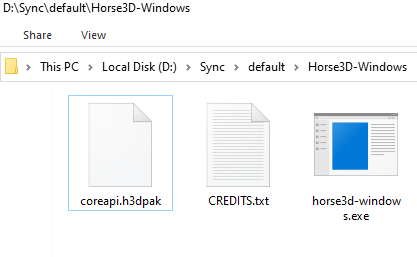
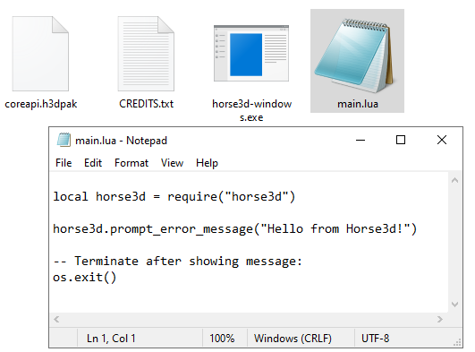
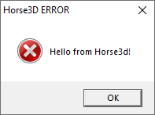

# Getting Started

## Installation of Horse3D

To get started with Horse3D, [download the latest version](https://horse3d.wobble.ninja/#get)
and [unzip it](https://www.wikihow.com/Open-a-.Zip-File-Without-Winzip#On-Windows).

You should now have a folder with these contents:



This is all you need to get started!


## Starting a new project

To create a game, write a new `main.lua` file with your game code contents.
For a quick test, try to show a message:

```lua
local horse3d = require("horse3d")

horse3d.prompt_error_message("Hello from Horse3D!")

-- Terminate after showing message:
os.exit()
```

Place this file in your engine folder like this:



*(Note: you may need to [show file extensions](https://www.wikihow.tech/Show-File-Extensions-on-Windows#Windows-10-and-8) under Windows to use the proper .lua file ending.)*

Now *double-click* the Horse3D binary to start it, and you should see
this message:



Congratulations, you ran your first [Lua](https://lua.org) code in Horse3D!


## Loading up a first 3D area

To load up a first 3D area, try this code in your `main.lua`:

```lua
local horse3d = require("horse3d")

horse3d.scene.add_scene("demo-assets/monumentoutdoors.gltf")  -- the level!

local player = horse3d.world.add_invisible_object(0.6, 1.7, {
    behavior=horse3d.behavior.humanoid_player()  -- the player!
})
```
*(Note: the demo-assets folder exists internally, you don't need to create it.)*

If you run it, you should now see a 3D area to walk around in.
Don't forget to remove the `os.exit()` at the end of your
 `main.lua` if you still have that from your previous example, or else
 it will quit immediately.


## More about Lua

All code you write in Horse3D is written as
[Lua](https://lua.org) scripts. In general, this documentation will
assume you know Lua basics, if you don't you may want to check out
[Lua tutorials to get started](
http://lua-users.org/wiki/TutorialDirectory). *If you are a Lua expert
already, you may want to see Horse3D's Lua's*
@{85_Misc_Lua_environment.md|special environment quirks}.
